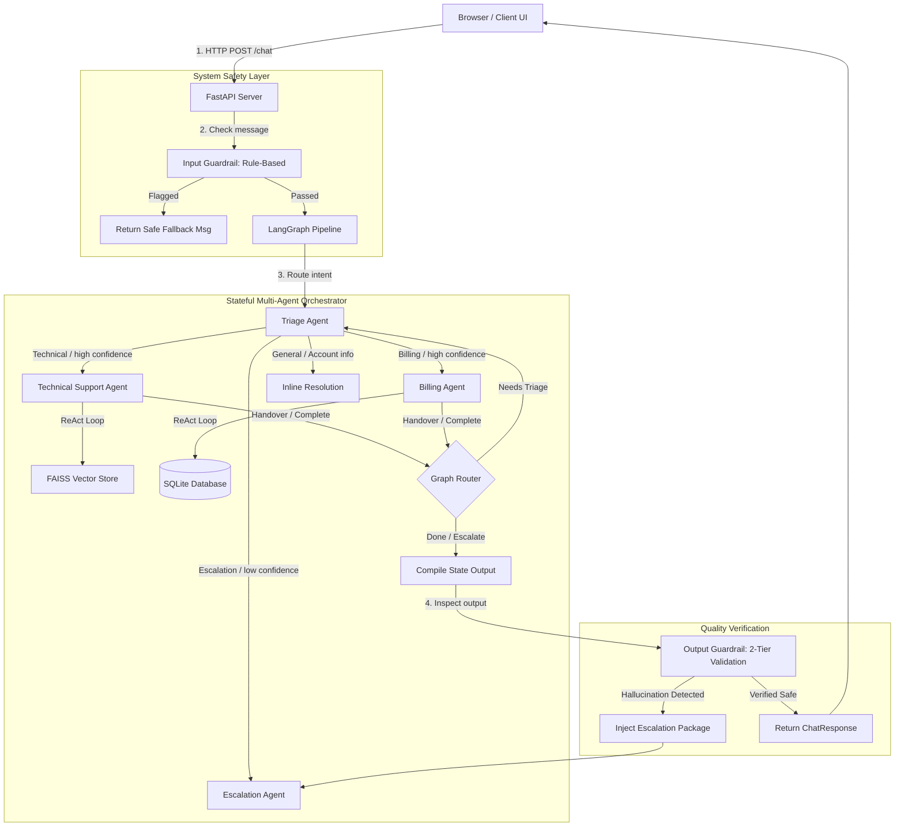
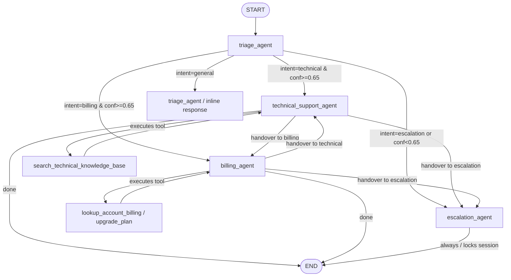

# ⚡ CloudDash Multi-Agent Customer Support System

<p align="center">
  <a href="https://huggingface.co/spaces/smit-faldu/claudedash" target="_blank">
    
  </a>
  &nbsp;&nbsp;
  <a href="https://github.com/smit-faldu" target="_blank">
    
  </a>
</p>

---

## 📖 Overview

**CloudDash** is a prototype of an advanced, production-grade **B2B SaaS Multi-Agent Customer Support System**. The backend orchestrates four specialized AI agents to handle end-to-end customer interactions for a fictional cloud infrastructure platform (offering metrics, alerts, and cost optimization). 

The system leverages **LangChain** and **LangGraph** to route queries based on intent, utilizes a local **FAISS** vector store for **RAG** (Retrieval-Augmented Generation) lookup, runs tool-based operations on a local **SQLite** database for billing management, enforces strict rule-based and LLM-assisted **Guardrails**, maintains state history across API calls, and features a simulated **Human Escalation Desk**.

---

## ✨ Key Features

* 🤖 **Triage Orchestrator (Intent Router)**: Classifies customer requests (Technical, Billing, General, Escalation) and extracts session-critical entities (e.g. `customer_id`, `urgency`, `error_code`) using Gemini's structured output.
* 📖 **Context-Aware RAG Pipeline**: Technical Support Agent rewrites queries based on context, searches a FAISS index embedded with `all-MiniLM-L6-v2`, and generates detailed troubleshooting instructions with citations (e.g., `TS-001`).
* 💳 **Automated Database Actions**: Billing Agent uses parameter-safe SQL queries to look up customer billing profiles, seat counts, resource limits, and updates subscription tiers in a SQLite database.
* 🛡️ **Two-Tier Input/Output Guardrails**: 
  - *Input Guard*: Rule-based, zero-latency filters protecting against prompt injection, PII leakage, and SQL injection attempts.
  - *Output Guard*: Post-process checks validating plan prices, verifying cited document IDs exist in fetched articles, detecting unauthorized refund claims, and running an LLM-as-a-judge comparison.
* 🧑‍💻 **Interactive Developer Tools Drawer**: A built-in diagnostic drawer in the UI client permitting developers to inspect live SQLite database tables (`users`, `subscriptions`, `invoices`) and query the RAG knowledge base articles directly.
* 🚨 **Escalation & Expert Chat**: Gracefully handles complex queries by packing conversational context, assigning priorities (`P1`-`P4`), and locking the chat to route messages directly to an expert desk UI.

---

## 🏗️ Request Lifecycle Architecture



---

## 📊 Graph Topology & Routing Logic

The LangGraph state machine routes nodes based on intent classification and active agent handovers. Multi-turn chat persistence is managed via an SQLite-backed checkpointer (`SqliteSaver`), bound to the customer's `session_id` (`thread_id`).



---

## 🛠️ Specialized Agents & Tool Definitions

All system prompts and routing configs are declared in [`config/agents_config.yaml`](file:///d:/extra/CloudDash/config/agents_config.yaml) to decouple prompt engineering from code logic.

### 1. Triage Agent (`triage_agent`)
* **Role**: First point of contact. Processes message history to classify intent and extract target entities.
* **Mechanism**: Leverages Gemini's structured output mode to guarantee format validation of `TriageResult`.

### 2. Technical Support Agent (`technical_support_agent`)
* **Tool**: `search_technical_knowledge_base(query)`
  - Formulates queries using context history.
  - Returns raw chunks from the FAISS vector database.
  - Requires citations for all output statements.

### 3. Billing Agent (`billing_agent`)
* **Tools**:
  - `lookup_account_billing_info(customer_id)`: Fetches user profiles, subscription levels, and past invoices.
  - `process_plan_upgrade(customer_id, new_plan)`: Performs upgrade operations matching SaaS pricing rules.
* **Rules**: Restricts users from performing refunds directly; triggers immediate Escalation.

### 4. Escalation Agent (`escalation_agent`)
* **Role**: Human handover packaging.
* **Outputs**: Creates a structured handover package including user logs, urgency parameters, recommended team (`engineering_oncall`, `billing_team`, `senior_support`), and locks the session state to block further AI processing.

---

## 💻 Built-in Developer Tools (Diagnostic Drawer)

The frontend features a **Developer Tools Drawer** (accessible via the gear button in the header) designed to monitor backend state dynamically:

1. **Database Viewer (`/dev/db`)**:
   - Inspects the full `users` table, search subscription packages, seats, and usage status.
   - Monitors live payment records and invoice updates (`INV-XXXX-XXXXXX`) in real time.
2. **Knowledge Base Viewer (`/dev/kb`)**:
   - Lists all loaded documents and articles.
   - Filters articles by category (`faq`, `troubleshooting`, `billing`, `api_docs`) or tag searches.
   - Inspects chunk files and document versions (`v1.0.0`).

---

## 🧑‍💼 Escalation Desk

When an issue is escalated:
1. The `is_escalated` flag in the graph is set to `True`.
2. The user is notified, and subsequent customer messages bypass the LangGraph pipelines, appending to the thread via `FastAPI` to populate the agent message feed.
3. Operators access the **Escalation Desk** (`/escalation` endpoint) to review priorities, session data, and respond directly.
4. Expert responses are saved back into the graph checkpointer, appearing seamlessly in the user's chat window.

---

## 🛡️ Guardrails Configuration

### Input Guardrail (Rule-Based)
Fast, regex-driven pattern matchers evaluating input strings before graph execution:
* **Prompt Injection**: Rejects override statements (e.g., `"ignore previous instructions"`, `"dan mode"`, `"system prompt"`).
* **PII/Config Protection**: Blocks queries probing file locations, internal DB names, or other user accounts.
* **Off-Topic / Spam**: Blocks requests unrelated to software infrastructure monitoring.
* **Token Stuffing Protection**: Enforces a strict limit of 4,000 characters.

### Output Guardrail (Two-Tier Validation)
* **Tier 1 (Rules)**:
  - Validates plan pricing against canonical values (Starter: $49, Growth: $149, Scale: $499).
  - Inspects citations: checks that any quoted article ID (e.g. `TS-001`) was actually retrieved.
  - Catches refund authority promises.
* **Tier 2 (LLM Judge)**:
  - Run asynchronously or on lower-confidence responses using a lightweight `gemini-3.1-flash-lite` judge to verify that the specialist agent did not hallucinate extra capabilities or violate server configurations.

---

## 📂 Project Directory Structure

```text
├── agents/
│   ├── __init__.py
│   └── agent_nodes.py          # Realisation of individual agent chains
├── api/
│   ├── __init__.py
│   ├── deps.py                 # Dependency injectors (graph, logging, configurations)
│   ├── schemas.py              # Pydantic schemas for request/response payloads
│   └── server.py               # FastAPI server and HTTP routers
├── config/
│   ├── agents_config.yaml      # Canonical prompts, models, thresholds, routing
│   └── config_loader.py        # Settings parsing engine
├── database/
│   ├── __init__.py
│   └── db_setup.py             # SQLite setup, seeding scripts, and data templates
├── db/                         # Checkpoint and relational database location (gitignored)
├── frontend/
│   ├── index.html              # Customer-facing multi-agent support client
│   └── escalation.html         # Human operator/expert workspace desk
├── graph/
│   ├── __init__.py
│   ├── graph.py                # LangGraph node bindings and state constructor
│   ├── router.py               # Pure, unit-testable graph conditional edges
│   └── state.py                # TypedDict state contract with reducers
├── guardrails/
│   ├── __init__.py
│   ├── input_guard.py          # Pre-processor filters
│   └── output_guard.py         # Post-processor filters and LLM judge logic
├── knowledge_base/
│   ├── articles/               # Source JSON files representing documentation
│   ├── faiss_index/            # Built FAISS vector store
│   └── generate_kb.py          # Sample content generation scripts
├── retrieval/
│   ├── __init__.py
│   ├── ingest.py               # recursive text splitter & FAISS embedding builder
│   └── retriever.py            # query rewriting and similarity retrival chain
├── scripts/
│   └── run_graph_demo.py       # Command-line testing scenario runner
├── requirements.txt            # Package dependencies list
├── Dockerfile                  # HF Spaces / Docker deployment guide
└── README.md                   # Project documentation (this file)
```

---

## ⚙️ Getting Started & Installation

### Prerequisites
* Python 3.10+
* Google Gemini API Key

### 1. Setup Local Environment
Clone the repository and configure dependencies:
```bash
# Create and activate virtual environment
python -m venv .venv
source .venv/bin/activate  # On Windows: .venv\Scripts\activate

# Install requirements
pip install -r requirements.txt
```

### 2. Configure Environment Variables
Create a `.env` file in the project root:
```env
GEMINI_API_KEY=your_gemini_api_key_here
# Optional model overrides:
# GEMINI_MODEL_DEFAULT=gemini-3.1-flash-lite
```

### 3. Initialize Databases & Vector Indices
Populate SQLite and ingest knowledge base documents into FAISS:
```bash
# Seed the Relational Database
python -m database.db_setup --force

# Ingest and Index the Technical Knowledge Base into FAISS
python -m retrieval.ingest --force
```

### 4. Start the Application
Run the backend FastAPI server:
```bash
# Launches on http://127.0.0.1:8000
python -m api.server
```
Once running:
- Open http://127.0.0.1:8000 in your browser to interact with the main support dashboard.
- Access http://127.0.0.1:8000/docs for Swagger REST API documentation.
- Open http://127.0.0.1:8000/escalation to access the human operator desk.

---

## 🐳 Docker Deployment & Hugging Face Spaces

This prototype includes a ready-to-use Docker configuration optimized for Hugging Face Spaces (port 7860):

```bash
# Build Docker Image
docker build -t clouddash-support .

# Run Docker Container
docker run -p 7860:7860 -e GEMINI_API_KEY="your_api_key" clouddash-support
```

---

## 💡 CLI Verification Scenarios

Run scripted conversational workflows through the terminal to verify state and routing behavior:

```bash
# Run real interactive test cases using Gemini
python scripts/run_graph_demo.py

# Perform a dry-run (skips API calls, verifying routing rules using keyword stubs)
python scripts/run_graph_demo.py --dry-run
```

---

## 🔗 Project Links & Resources
* **Live Workspace (Hugging Face Spaces)**: [https://huggingface.co/spaces/smit-faldu/claudedash](https://huggingface.co/spaces/smit-faldu/claudedash)
* **GitHub Profile**: [https://github.com/smit-faldu](https://github.com/smit-faldu)
